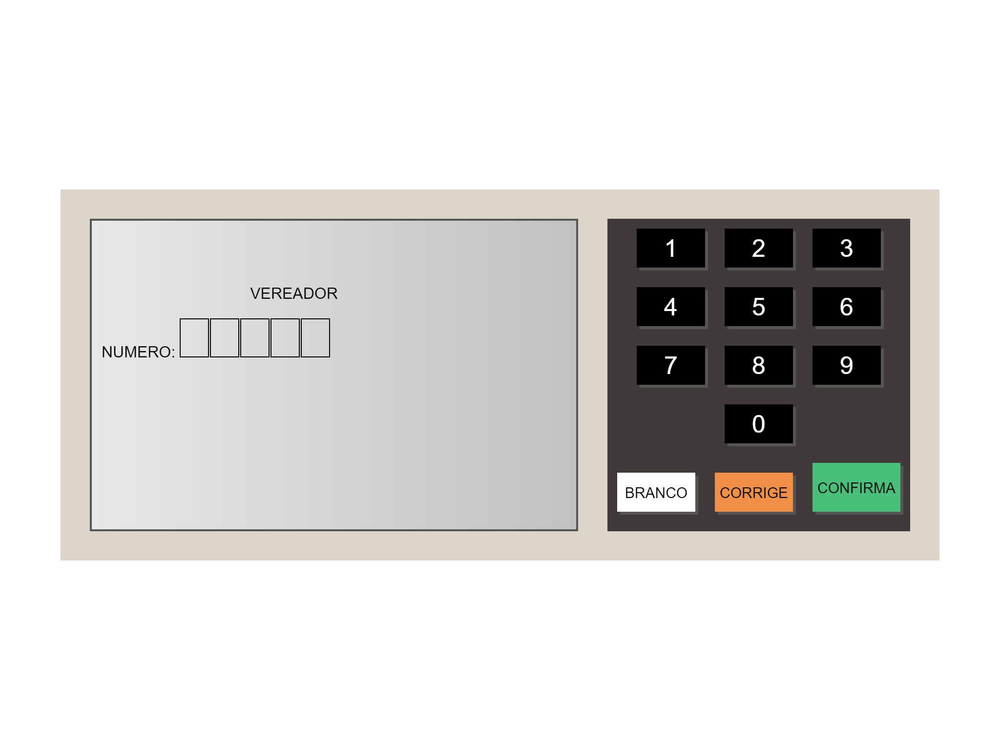
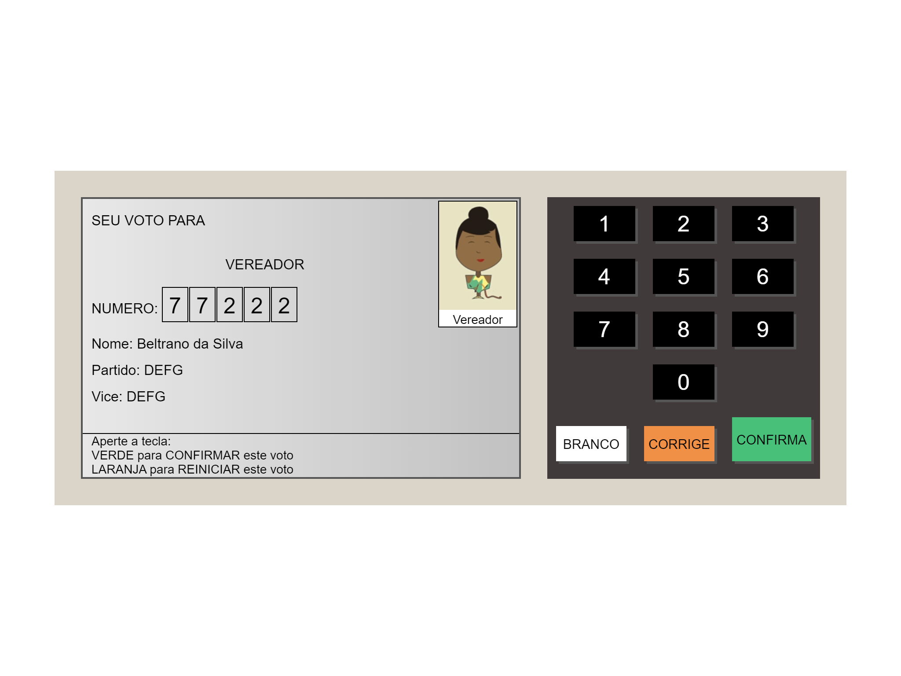
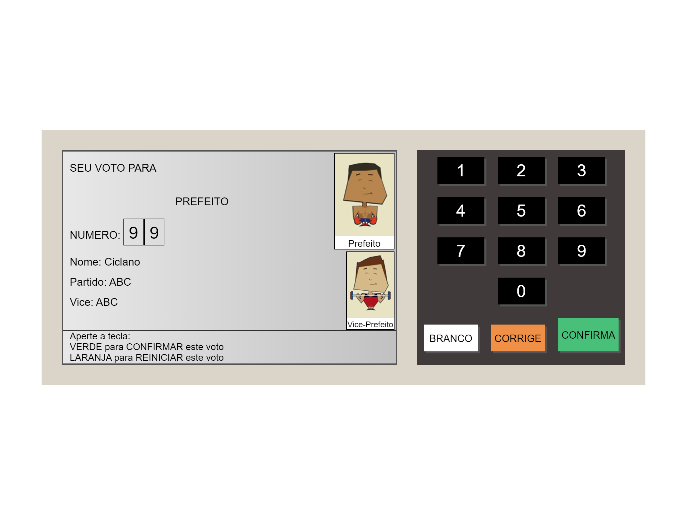

# Urna Eletrônica

  

  
  
  
  
	
  

## 💻 Projeto

Urna Eletrônica é um projeto simples em Javascript, html e css. Foi feito durante o curso da [B7web](https://alunos.b7web.com.br/).

## - 🌐 Web

> https://luizpedrosm.github.io/b7-js-urna-eletronica/

## 📷 Imagens

<h1 align="center">
    
</h1>
<h1 align="center">
    
</h1>
<h1 align="center">
    
</h1>

## 🚀 Tecnologias

Esse projeto foi desenvolvido com as seguintes tecnologias:

- [HTML](https://www.w3schools.com/html/default.asp)
- [CSS](https://www.w3schools.com/css/default.asp)
- [JavaScript](https://www.w3schools.com/js/default.asp)
